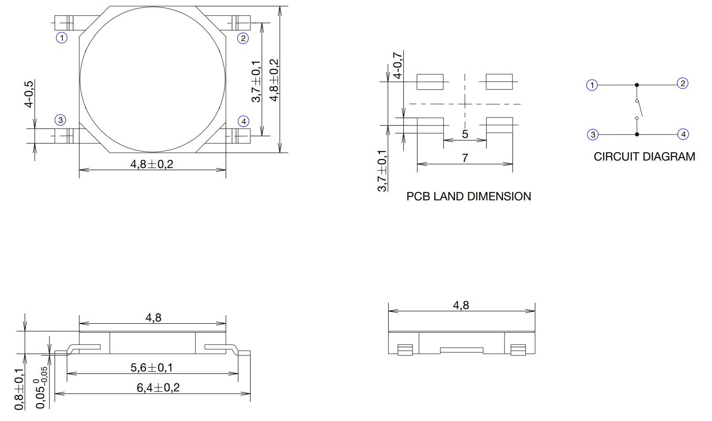

# Keyboard for TI Majestic Series Calculators #

1970's TI calculatore keyboards are known for failure - squishy or dead keys - leading to premature death.
As the original keyboards are generally unrepairable, this is a replacement using a PCB and micro tactile switches.
Enjoy the use of technology advanced during the mobile phone era (0.8mm thickness tact switches!).

## Details: ##

The PCB + switch comes to 2.4mm thick, which is nearly identical to the original 2.2mm thick keyboard in these calculators.

Two versions are included:
* 5 Column x 8 Row: made for a TI45, but I understand should also fit a standard TI30
* 5 Column x 9 Row: suits a TI58, TI59 programmable

## Swtich Type: ##

Switches are a reasonably common SMD type (Dimensions: 4.8mm x 4.8mm x 0.8mm) available from electrical component wholesalers and elsewhere online at low cost.
As long as it matches the drawing below, it should be compatible.
Some sources (apologies if links expire):
* Digikey: [PTS526 SM08 SMTR2 LFS](https://www.digikey.com.au/short/9qb5pmcp)
* Aliexpress: [100 Pcs/lot Membrane Switch 4x4x 0.8MM 4X4X0.8mm Tactile Push Button Switch Tact 4 Pin 4*4*0.8mm Switch Micro Switch SMD](https://www.aliexpress.com/item/4001331647427.html)
* Amazon: [eMagTech 50pcs 4 Pin Patch Tact Switch Tactile Switch for Car Remote Control Key 4.8x4.8x0.8mm 4 Pin Tactile Push Button Switch Metal Plastic Switch](https://www.amazon.com.au/eMagTech-Tactile-Control-4-8x4-8x0-8mm-Plastic/dp/B0CN9467VQ)

## How to: ##

### Building the keyboard: ###
1. Solder the tact switches to the PCB. Ensure they are accurately located (use the silkscreen layout), and flat on the PCB.
2. Solder 50mm (2in) approx. lead wires (I use copper strands from 2.5mm^2 house wiring) to each wire header, on the front (key) side of the board, extending upwards.
Note: for rev0, I made an error with the offset of two of the pins (R3 and R8), which is easily corrected with the lead wires. Rev1 of the board has this fixed, so it's a direct match for the original.

### Installation: ###
1. Open the calculator case (typically for Majestics: unclip the clips inside the battery compartment, and then push the rear case part downwards to separate front and back).
2. Desolder the original keyboard at the main board.
3. Assemnble into the calculator, align all the lead wires and insert into the main board. It is imporatant to ensure the lead wires are bent/routed as per the original keyboard so the case will fit back together. This varies between calculator types.
4. Solder lead wires to main board, and trim.
5. Reassemble calculator.

   
## Requests & PCBs:

Please do let me know if you have requests for further types.
And if you'd like a PCB or a built one, let me know!
Contact me at: info@calcpsu.com.au

## License

As per below, you are welcome to reproduce, amend, modify for personal use & friends.
I request you do not use this design for commercial production - i.e. no retail listings please. I'll give you a pass for a 'batch' where costs are shared.

This work is licensed under a
[Creative Commons Attribution-NonCommercial-ShareAlike 4.0 International License][cc-by-nc-sa].

[![CC BY-NC-SA 4.0][cc-by-nc-sa-image]][cc-by-nc-sa]

[cc-by-nc-sa]: http://creativecommons.org/licenses/by-nc-sa/4.0/
[cc-by-nc-sa-image]: https://licensebuttons.net/l/by-nc-sa/4.0/88x31.png
[cc-by-nc-sa-shield]: https://img.shields.io/badge/License-CC%20BY--NC--SA%204.0-lightgrey.svg

## The paitent: ##
A TI-45, the only Majestic with a VFD display, available in the European market.
Unusual, as most of this series had LED displays.

