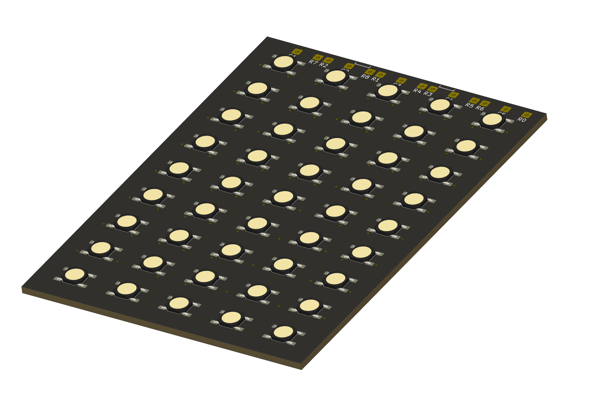

# Keyboard for TI Majestic Series Calculators #

1970's TI calculatore keyboards are known for failure - squishy or dead keys - leading to premature death.
As the original keyboards are generally unrepairable, this is a replacement using a PCB and micro tactile switches.
Enjoy the use of technology advanced during the mobile phone era (0.8mm thickness tact switches!).

## Details: ##

The PCB + switch comes to 2.4mm thick, which is nearly identical to the original 2.2mm thick keyboard in these calculators.

Two versions are included:
* 5 Column x 8 Row: made for a TI45, but I understand should also fit a standard TI30
* 5 Column x 9 Row: suits a TI58, TI59 programmable

## Swtich Type: ##

Switches are a reasonably common SMD type (Dimensions: 4.8mm x 4.8mm x 0.8mm) available from electrical component wholesalers and elsewhere online at low cost.
As long as it matches the drawing below, it should be compatible.
Some sources (apologies if links expire):
* Digikey: [PTS526 SM08 SMTR2 LFS](https://www.digikey.com.au/short/9qb5pmcp)
* Aliexpress: [100 Pcs/lot Membrane Switch 4x4x 0.8MM 4X4X0.8mm Tactile Push Button Switch Tact 4 Pin 4*4*0.8mm Switch Micro Switch SMD](https://www.aliexpress.com/item/4001331647427.html)

## Requests & PCBs:

Please do let me know if you have requests for further types.
And if you'd like a PCB or a built one, let me know!

## License

As per below, you are welcome to reproduce, amend, modify for personal use & friends.
I request you do not use this design for commercial production - i.e. no retail listings please. I'll give you a pass for a 'batch' where costs are shared.

This work is licensed under a
[Creative Commons Attribution-NonCommercial-ShareAlike 4.0 International License][cc-by-nc-sa].

[![CC BY-NC-SA 4.0][cc-by-nc-sa-image]][cc-by-nc-sa]

[cc-by-nc-sa]: http://creativecommons.org/licenses/by-nc-sa/4.0/
[cc-by-nc-sa-image]: https://licensebuttons.net/l/by-nc-sa/4.0/88x31.png
[cc-by-nc-sa-shield]: https://img.shields.io/badge/License-CC%20BY--NC--SA%204.0-lightgrey.svg
