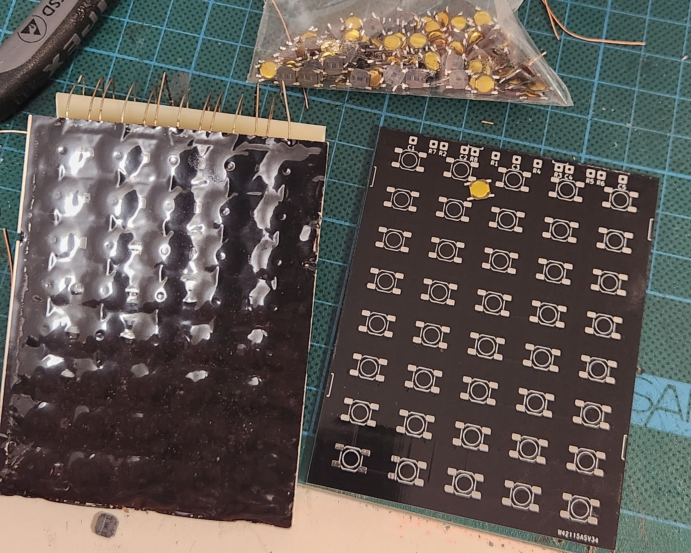

# Keyboard for TI Majestic Series Calculators #

1970's TI calculatore keyboards are known for failure - squishy or dead keys - leading to premature death.
As the original keyboards are generally unrepairable, this is a replacement using a PCB and micro tactile switches.
Enjoy the use of technology advanced during the mobile phone era (0.8mm thickness tact switches!).

## Details: ##

The PCB + switch comes to 2.4mm thick, which is nearly identical to the original 2.2mm thick keyboard in these calculators.

Two versions are included:
* 5 Column x 8 Row: made for a TI45, but I understand should also fit a standard TI30
* 5 Column x 9 Row: suits a TI58, TI59 programmable

## Switch Type: ##

Switches are a reasonably common SMD type (Dimensions: 4.8mm x 4.8mm x 0.8mm) available from electrical component wholesalers and elsewhere online at low cost. There is another type with a metal top cover, often sold as '1.0mm' thick, but is likely identical button underneath. These work well too (and might be a bit more durable). As long as it matches the drawing below, it should be compatible.
Some sources (apologies if links expire):
* Digikey: [PTS526 SM08 SMTR2 LFS](https://www.digikey.com.au/short/9qb5pmcp)
* Aliexpress: [100 Pcs/lot Membrane Switch 4x4x 0.8MM 4X4X0.8mm Tactile Push Button Switch Tact 4 Pin 4*4*0.8mm Switch Micro Switch SMD](https://www.aliexpress.com/item/4001331647427.html) or [SJMS 100pcs Micro Tactile Push Button Touch Tact Waterproof Switch 4x4x1 SMD 4 Pin SMT 4*4*1.0 mm Ultra thin mini Switch](https://www.aliexpress.com/item/1005001828986512.html)
* Amazon: [eMagTech 50pcs 4 Pin Patch Tact Switch Tactile Switch for Car Remote Control Key 4.8x4.8x0.8mm 4 Pin Tactile Push Button Switch Metal Plastic Switch](https://www.amazon.com.au/eMagTech-Tactile-Control-4-8x4-8x0-8mm-Plastic/dp/B0CN9467VQ)

## How to: ##

Before committing to replacing your keyboard, please consider the risks involved in working on ancient electronics. Components are sensitive to ESD, plastics and PCBs are old and susceptible to mechanical damage (hairline cracking you may not even see!). If damaged, replacement parts are typically not available at all, so damage can be irrepairable. While I have successfully replaced the keyboards on a number of my calculators, I've lost at least one calculator to ESD death during a (not keyboard related) repair attempt. As such, I cannot provide any guarantees of success but I do wish you the best of luck if you do choose to proceed. The below instructions are provided for you to undertake at your own risk.

### Building the keyboard: ###
1. Solder the tact switches to the PCB. Ensure they are accurately located (use the silkscreen layout), and flat on the PCB.
   - The switches are small and are easy to overheat when soldering - which can damage and change the feel. Use a temperature controlled iron and try to limit the heat you apply!
   - The switches need to be flat on the board, if they are raised (which can occur when soldering), the buttons will have inconsistent feel.
   - I have had some success using a tiny dab of superglue applied with a needle to locate the switches prior to soldering.
   - Do not press the switches down with any sharp objects (tweezers, screwdrivers, etc.) - this can deform the dome and again, result in inconsistent feel.
2. Solder 50mm (2in) approx. lead wires (I use copper strands from 2.5mm^2 house wiring) to each wire header, on the front (key) side of the board, extending upwards. _Note: for TI-59, the leadwires can be shorter (about 15mm is plenty)._

_Note: for Rev0, I made an error with the offset of two of the pins (R3 and R8), which is easily corrected with the lead wires. Rev1 of the board has this fixed, so it's a direct match for the original._

### Installation (Majestic series TI30/TI55/Programmer/TI45 and similar): ###
_Note: These calculators have early MOS ICs, which have no or minimal ESD protection in comparison to modern ICs. It is more important to take precautions than you might be used to with modern electronics!. Use an ESD mat and strap if you have one._
1. Open the calculator case: unclip the clips inside the battery compartment with a narrow ruler or wide screwdriver, and then push the rear case part downwards to separate front and back.
2. Desolder the original keyboard at the main board.
3. Assemble into the calculator, align all the lead wires and insert into the main board. It is imporatant to ensure the lead wires are bent/routed as per the original keyboard so the case will fit back together. This varies between calculator types.
4. Solder lead wires to main board, and trim.
5. Reassemble calculator.

### Installation (TI59 and similar): ###
The TI59 is a more complex calculator - the below instructions worked for me, please do get in touch via issues or email if you have any questions or problems.
_Note: These calculators have early MOS ICs, which have no or minimal ESD protection in comparison to modern ICs. It is more important to take precautions than you might be used to with modern electronics!. Use an ESD mat and strap if you have one._
1. Remove battery
2. Open calculator case by unscrewing the two fasteners on the back. Unclip the back case by lifting the back slightly, and sliding the back part of the case downwards to releasee the clips at the bottom.
3. Remove 2x flex cables from the card reader, noting how these are routed around the components and case.
4. Remove 4x screws from the card reader.
5. Remove the card reader and power switch by lifting out.
6. Use a small screwdriver to push up the two keyboard clips at the top of the keyboard via the cutouts in the mainboard.
7. Lift the mainboard and keyboard out from the top: take care not to lose any keys (they are loose!). Clean up as much crumbled foam as you can from the keyboard area.
8. Place the new foam pad over the keys.
9. Carefully desolder the 14 keyboard wires from the mainboard and remove the keyboard, ensuring you repair any damaged tracks and clean up flux residue (I use IPA and lots of q-tips).
10. Remove the black plastic spacer from the back of the keyboard.
11. Cut off the small locating pins from the black spacer, and sand or file these completely flush.
12. Locate the black spacer on the mainboard, and fix in place for reassembly with a very small amount of glue (e.g. superglue).
13. Fit the new keyboard to the mainboard, **leaving the wires unsoldered for the moment.**
14. Install the keyboard and mainboard into the front part of the case - slot the bottom of both in first, and gently press down the top until clipped in. Press around the mainboard to make sure everything is seated correctly.
15. Reinstall the card reader with 4x screws.
16. Check the action of the buttons, if feels ok continue, otherwise disassemble again (remove keyboard/mainboard) and see keyboard fit adjustment below.
17. Reinstall the flex cables for the card reader. Ensure the flex cable is routed correctly (as you noted previously).
18. Reinstall the back of the case by slotting into the bottom, and pressing up and down over. Take care not to damage the flex cables or components on the mainboard while doing so.
19. Reinstall the two screws on the back of the case.
20. Check the action of the buttons, if feels ok continue, otherwise disassemble again and see keyboard fit adjustment below.
21. Now solder a few of the keyboard leadwires, accessing through the back of the battery compartment. You don't need to solder them all, just enough to make sure the relative position of the keyboard and mainboard is locked in.
22. Now remove the back of the case and card reader flex cables, so you can solder and trim all the rest of the keyboard leadwires.
23. Reinstall the card reader flex cables, reinstall the back of the case.
24. Reinstall the battery (or connect to 3.3-5.0V power supply, taking care with polarity, which is marked on the mainboard) and test the keyboard/calculator works!

#### Keyboard Fit Adjustment ###
The keyboard is obviously not an exact copy of the original. The action of the small buttons is shorter than the original keyboard, and is slightly less tolerant to fit. You can adjust the fit through a number of methods, to address the two main possible problems:
1. Keys are squished with reassembly of the back of the case, and constantly pressed (particularly bottom row):
   a. Add tape or foam pieces to the front of the keyboard, to apply more pressure between the case front and the keyboard in the affected location.
   b. Make sure the spacer between the keyboard and mainboard locating posts are completely flat / fully removed. You may want to sand the spacer flat (fine - 320 grit or higher - sandpaper on the bench, rub the spacer on this a few times and observe progress until area around each pin is visibly abraded).
   c. File/sand the posts in the rear part of the case that go through the mainboard and contact the keyboard, to reduce pressure from the back of the case in the relevant locations (e.g. for bottom row issues, focus on the ones at the bottom of the case back). Don't go too far, or the key action may become loose.
2. Keys rattle or feel loose (you may have gone too far with one of the above steps):
   a. Make sure you have put that black spacer between the keyboard and mainboard. It's necessary to fully support the keyboard against the pressure from the foam pad.
   b. Apply tape or foam to the back of the keyboard in key locations (where the case back posts contact and support the keyboard) to increase pressure toward the front of the case.
   c. Consider a thicker foam pad between the keys (although this can increase the force required to press keys). It is unlikely you'll want more than 1.5mm.

## Replacing the foam:

The foam layer between the keycaps and the switches is significant to maintain the feel of the keypad. Without it, the keycaps rattle and the key feel is plasticky. It is often crumbly and degraded with age. It can be replaced with a slice of 1mm EVA foam, again widely available from craft stores and online:
* [NEW 1pcs Thickness 1/2/3/5/10mm Eva Foam Sheets Sound-Absorbing Noise Spone Foam Craft Eva Sheets Handmade Model Making Material](https://www.aliexpress.com/item/1005005567697486.html)

   
## Requests & PCBs:

Please do let me know if you have requests for further types.
And if you'd like a PCB or a built one, let me know - happy to provide bare PCBs, kits or assembled keyboards (to order).

Contact me at: info@calcpsu.com.au

## License

As per below, you are welcome to reproduce, amend, modify for personal use & friends.
I request you do not use this design for commercial production - i.e. no retail listings please. I'll give you a pass for a 'batch' where costs are shared.

This work is licensed under a
[Creative Commons Attribution-NonCommercial-ShareAlike 4.0 International License][cc-by-nc-sa].

[![CC BY-NC-SA 4.0][cc-by-nc-sa-image]][cc-by-nc-sa]

[cc-by-nc-sa]: http://creativecommons.org/licenses/by-nc-sa/4.0/
[cc-by-nc-sa-image]: https://licensebuttons.net/l/by-nc-sa/4.0/88x31.png
[cc-by-nc-sa-shield]: https://img.shields.io/badge/License-CC%20BY--NC--SA%204.0-lightgrey.svg

## The paitent: ##
A TI-45, the only Majestic with a VFD display, available in the European market.
Unusual, as most of this series had LED displays.

